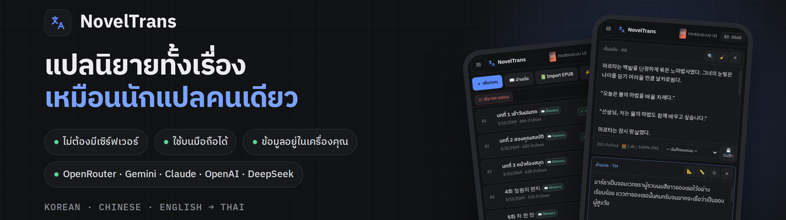
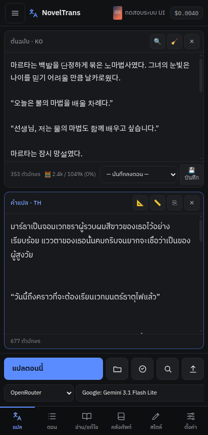
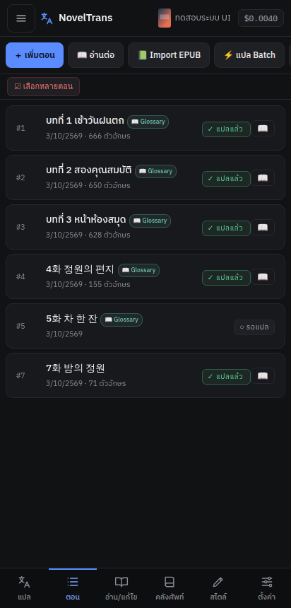
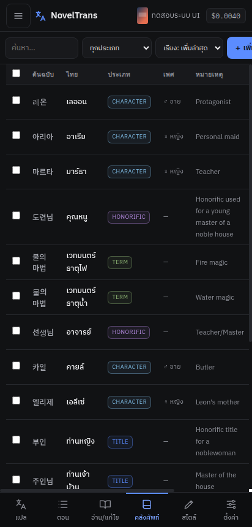
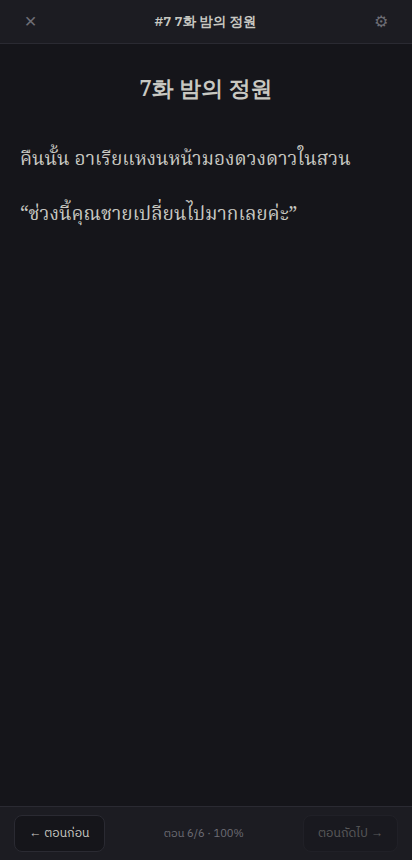
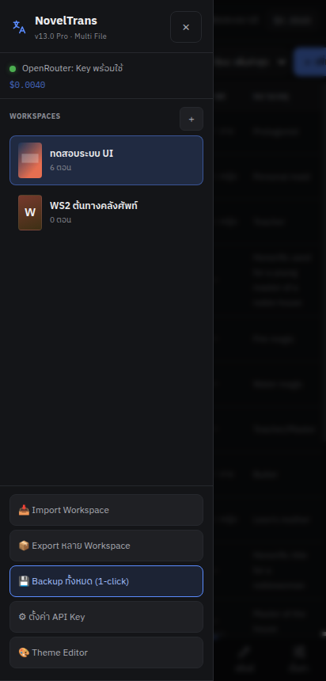
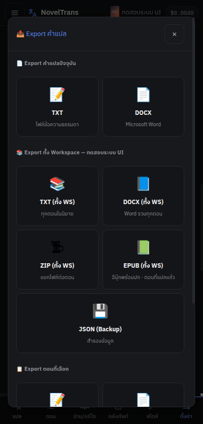

<div align="center">



# NovelTrans

**เครื่องมือแปลนิยายเว็บด้วย AI สำหรับนักแปลไทย — เกาหลี · จีน · อังกฤษ → ไทย**<br/>
แปลทั้งเรื่องให้คำเรียก ชื่อ และสำนวน **ต่อเนื่องเหมือนคนคนเดียวแปล** · ใช้บนมือถือได้ · ไม่ต้องมีเซิร์ฟเวอร์

[](https://github.com/Banchon999/Novel-Tran-Pro/releases/latest)
[](https://github.com/Banchon999/Novel-Tran-Pro/stargazers)
[](https://github.com/Banchon999/Novel-Tran-Pro/commits/main)


[**⬇ ดาวน์โหลดเวอร์ชันล่าสุด**](https://github.com/Banchon999/Novel-Tran-Pro/releases/latest) · [เริ่มใช้ใน 1 นาที](#-เริ่มใช้ใน-1-นาที) · [ฟีเจอร์](#-ทำอะไรได้บ้าง) · [English](#-english)

</div>

---

## 🤔 ทำไมต้อง NovelTrans

แปลนิยายด้วย AI ตรง ๆ มักเจอปัญหาเดิมซ้ำ ๆ — **ตอนนี้ทับศัพท์ ตอนหน้าแปลความหมาย**, ชื่อตัวละครสะกดไม่เหมือนเดิม, ตัวละครชายพูด "ค่ะ", คำเรียก "คุณชาย" กลายเป็น "คุณหนู" อ่านแล้วเหมือนคนละคนแปล

NovelTrans เอาวิธีที่ทีมแปลมืออาชีพใช้ มาทำให้อัตโนมัติ:

| ปัญหาที่เจอ | NovelTrans แก้ยังไง |
|---|---|
| ชื่อ/ศัพท์เฉพาะสะกดไม่เหมือนเดิมทุกตอน | **คลังศัพท์อัตโนมัติ** — สกัดคำใหม่ *ก่อนแปล* แล้วบังคับใช้คำเดียวกันทุกตอน |
| ตอนนี้ทับศัพท์ ตอนหน้าแปล | **คู่มือการแปล (Style Sheet)** — AI ร่างนโยบายจากต้นฉบับทั้งเรื่อง ยึดตลอด |
| ผลแปลสุ่มเปลี่ยนทุกครั้ง | **แปลแบบคงที่** — คุม temperature ให้เลือกคำเดิม |
| ผู้ชายพูด "ค่ะ" / เขา–เธอ สลับ | **ระบุผู้พูด + ตรวจเพศ** ทุกบทพูด ก่อนและหลังแปล |
| ตอนก่อนกับตอนนี้สำนวนไม่ต่อกัน | ส่ง **ท้ายตอนก่อน + สรุปเรื่อง** ให้ AI ทุกครั้งอัตโนมัติ |

> วัดจริงด้วยชุดทดสอบใน [`tests/consistency`](tests/consistency) — ตอนเดียวกันแปล 3 รอบ ได้ผลเหมือนกัน **57% → 84–90%** และศัพท์ใช้คำเดียวตลอด **8/8**

## ✨ ทำอะไรได้บ้าง

<table>
<tr>
<td width="33%" align="center"><br/><b>แปลแบบ stream</b><br/><sub>ดูคำแปลไหลออกมาสด ๆ · แบ่ง chunk อัตโนมัติ</sub></td>
<td width="33%" align="center"><br/><b>จัดการทั้งเรื่อง</b><br/><sub>นำเข้า EPUB · แปลหลายตอนรวด (Batch)</sub></td>
<td width="33%" align="center"><br/><b>คลังศัพท์ + เพศตัวละคร</b><br/><sub>สกัดอัตโนมัติ · ตรวจคำซ้ำ/คำซ้อน</sub></td>
</tr>
<tr>
<td align="center"><br/><b>อ่านเต็มจอ + Prefetch</b><br/><sub>อ่านตอนนี้ ตอนถัดไปแปลรอไว้แล้ว</sub></td>
<td align="center"><br/><b>หลายเรื่อง พร้อมภาพปก</b><br/><sub>แยกคลังศัพท์/ตั้งค่าต่อเรื่อง</sub></td>
<td align="center"><br/><b>ส่งออก EPUB · DOCX · TXT</b><br/><sub>EPUB มาตรฐาน (ผ่าน epubcheck) พร้อมปก</sub></td>
</tr>
</table>

**ฟีเจอร์ทั้งหมดโดยย่อ**

- 🌐 **ต้นฉบับ 3 ภาษา** — เกาหลี · จีน · อังกฤษ (ตรวจภาษาอัตโนมัติ, prompt และกฎเปลี่ยนตามภาษา)
- 🤖 **ใช้ AI ได้หลายเจ้า** — OpenRouter (รวมทุกโมเดล) · Google Gemini · OpenAI · Anthropic Claude · DeepSeek
- 📖 **คลังศัพท์อัตโนมัติ** — สกัดชื่อ/สถานที่/สกิล/คำประจำแนว พร้อมเพศตัวละคร ก่อนแปลทุกตอน
- 📘 **คู่มือการแปล** — นโยบายทับศัพท์, คำประจำเรื่อง, น้ำเสียงบรรยาย, รูปแบบข้อความระบบ, น้ำเสียงตัวละคร
- 🗣 **ครับ/ค่ะ ถูกเพศ** — ระบุผู้พูดทุกบทพูด, ตรวจ เขา/เธอ และคำเรียกขานหลังแปล
- ⚡ **แปลหลายตอนรวด** — Batch พร้อม log และตรวจคำหลุดคลังทุกตอน
- 📱 **PWA** — ติดตั้งบนหน้าจอโฮม, ใช้ออฟไลน์ได้, ออกแบบมาสำหรับมือถือก่อน
- 🔒 **ข้อมูลอยู่ในเครื่องคุณ** — เก็บใน IndexedDB ของเบราว์เซอร์, API Key ไม่ส่งไปที่อื่นนอกจากผู้ให้บริการ AI
- 💾 **สำรอง/กู้คืน 1 คลิก** — Backup ทุกเรื่องเป็นไฟล์เดียว
- 💸 **ประหยัด** — แสดงต้นทุนจริงทุกครั้ง · Gemini Flash Lite ประมาณ $0.001–0.01 ต่อตอน (ขึ้นกับความยาว)

## 🚀 เริ่มใช้ใน 1 นาที

> ต้องเปิดผ่าน `http://` เสมอ (เปิดไฟล์ตรง ๆ แบบ `file://` ไม่ได้ เพราะเบราว์เซอร์ไม่ให้ใช้ฐานข้อมูล)

**📱 มือถือ Android — ง่ายสุด**
1. ดาวน์โหลด `NovelTrans-vX.Y.Z.zip` จาก [Releases](https://github.com/Banchon999/Novel-Tran-Pro/releases/latest) แล้วแตกไฟล์
2. ติดตั้งแอป [Simple HTTP Server](https://shttps.phlox.dev/) → ชี้ไปที่โฟลเดอร์ `NovelTrans` → กด Start
3. เปิดเบราว์เซอร์ที่ `http://localhost:พอร์ต` → เมนู ☰ → ⚙ ตั้งค่า API Key → สร้างเรื่องแรก

<details>
<summary><b>🐧 Termux (Android)</b></summary>

```bash
pkg install python
cd ~/storage/shared/NovelTrans && ./serve.sh   # หรือ python3 -m http.server 8080
```
เปิด `http://localhost:8080`
</details>

<details>
<summary><b>💻 คอมพิวเตอร์ (Windows / macOS / Linux)</b></summary>

```bash
git clone https://github.com/Banchon999/Novel-Tran-Pro.git
cd Novel-Tran-Pro
python3 -m http.server 8080
```
เปิด `http://localhost:8080` · หรืออัปโหลดทั้งโฟลเดอร์ขึ้นเว็บโฮสต์ static ใดก็ได้ (GitHub Pages, Netlify, Cloudflare Pages)
</details>

<details>
<summary><b>🔑 เอา API Key จากไหน</b></summary>

- **แนะนำ: [OpenRouter](https://openrouter.ai/keys)** — key เดียวใช้ได้ทุกโมเดล (Gemini, Claude, GPT, DeepSeek ฯลฯ) เติมเงินขั้นต่ำน้อย
- หรือใช้ key ตรงจาก Google AI Studio / OpenAI / Anthropic / DeepSeek ก็ได้
- กด **🔄 Fetch** ในหน้าตั้งค่าเพื่อดึงรายชื่อโมเดลล่าสุด
</details>

## ❓ คำถามที่พบบ่อย

<details><summary><b>ข้อมูลนิยายของฉันถูกส่งไปที่ไหนบ้าง?</b></summary>

ไม่มีเซิร์ฟเวอร์ของ NovelTrans เลย — แอปทำงานในเบราว์เซอร์ของคุณทั้งหมด ข้อความจะถูกส่งไปที่ผู้ให้บริการ AI ที่คุณเลือกเท่านั้น (ตอนกดแปล)
</details>

<details><summary><b>เปลี่ยนเครื่อง / ล้างเบราว์เซอร์ ข้อมูลหายไหม?</b></summary>

ข้อมูลอยู่ในเบราว์เซอร์ ถ้าล้างข้อมูลเว็บจะหาย — กด **💾 Backup ทั้งหมด** เป็นระยะ (แอปเตือนให้) แล้วนำเข้าที่เครื่องใหม่ได้ทันที
</details>

<details><summary><b>โมเดลไหนคุ้มที่สุด?</b></summary>

เริ่มที่ **Gemini Flash Lite** (ถูกและเร็ว) สำหรับแปลประจำ · ใช้โมเดลใหญ่กว่า (เช่น Gemini Pro / Claude) เป็น "โมเดลตรวจ" สำหรับงานที่ต้องแม่นยำ เช่น ตรวจเพศ และร่างคู่มือการแปล
</details>

<details><summary><b>รองรับภาษาญี่ปุ่นไหม?</b></summary>

ยังไม่รองรับอย่างเป็นทางการ (อยู่ในแผน) — ตอนนี้รองรับ เกาหลี · จีน · อังกฤษ
</details>

## 🗺 แผนต่อไป

- [ ] ต้นฉบับภาษาญี่ปุ่น
- [ ] ซิงก์ข้อมูลข้ามอุปกรณ์ (เลือกได้, เข้ารหัส)
- [ ] เปรียบเทียบคำแปลจากหลายโมเดลแบบเคียงกัน

มีไอเดียหรือเจอบั๊ก? เปิด [Issue](https://github.com/Banchon999/Novel-Tran-Pro/issues) ได้เลย

## 🛠 สำหรับนักพัฒนา

เว็บแอป static ล้วน (Vanilla JS, ไม่มี build step) — แก้ไฟล์แล้วรีเฟรชได้ทันที

```
index.html · style.css · sw.js (PWA)
js/app.core.js          state, prompts, storage (IndexedDB), ภาษาต้นฉบับ
js/app.providers.js     ผู้ให้บริการ AI, ดึงรายชื่อโมเดล, ต้นทุน
js/app.translate.js     แกนการแปล, คลังศัพท์อัตโนมัติ, ระบุผู้พูด, ตรวจเพศ
js/app.reader-presets.js  อ่านเต็มจอ, Prefetch, Preset
js/app.review-batch.js  แปลหลายตอน, ส่งออก, นำเข้า EPUB
js/app.tools.js         ส่งออก EPUB, เครื่องมือคลังศัพท์, ธีม
tests/                  ชุดวัดความต่อเนื่องและเพศ (ใช้ AI จริง)
```

รายละเอียดระบบทั้งหมด: [`SYSTEMS.md`](SYSTEMS.md) · ประวัติการพัฒนา: [`docs/HISTORY.md`](docs/HISTORY.md)

---

## 🇬🇧 English

**NovelTrans** is a mobile-first, serverless web app for translating web novels (**Korean, Chinese, English → Thai**) with AI — built so a whole series reads as if **one translator** did it.

- **Auto glossary** — extracts names, places, skills and genre terms (with character gender) *before* each chapter is translated, then enforces them.
- **Translation style sheet** — an AI-drafted policy (transliterate vs. translate, recurring terms, narration voice, character voices) computed from the whole source, injected into every request.
- **Consistency controls** — stable temperature, previous-chapter context, speaker identification and post-translation gender checks for Thai pronouns and polite particles (ครับ/ค่ะ).
- **Bring your own AI** — OpenRouter, Google Gemini, OpenAI, Anthropic Claude, DeepSeek; real per-request cost display.
- **Reader + prefetch, batch translation, EPUB/DOCX/TXT export, per-novel covers, PWA/offline, one-click backup.**
- **Private by design** — no backend; everything lives in your browser's IndexedDB.

Run it: download a [release](https://github.com/Banchon999/Novel-Tran-Pro/releases/latest), serve the folder over HTTP (`python3 -m http.server 8080`), open `http://localhost:8080`.

---

<div align="center">

### ⭐ ถ้า NovelTrans ช่วยงานแปลของคุณได้ ฝากกดดาวให้หน่อยนะครับ

ดาวช่วยให้นักแปลคนอื่นเจอโปรเจกต์นี้ และเป็นกำลังใจให้พัฒนาต่อ

[](https://star-history.com/#Banchon999/Novel-Tran-Pro&Date)

</div>
